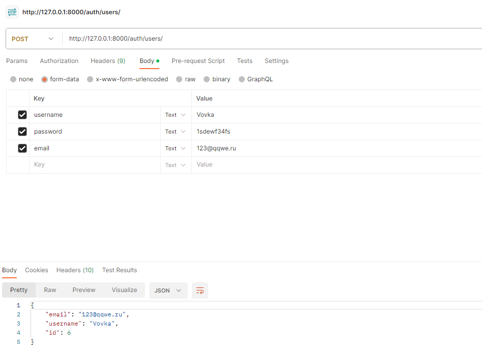

# NewCARS
ДЗ на 20.12.22 
Подключить Swagger

1. Установите drf-yasg с помощью pip:
```
pip install drf-yasg
```
2. Добавьте drf_yasg в INSTALLED_APPS в файле настроек Django:
```
python
Copy code
INSTALLED_APPS = [     # ...     'drf_yasg',     # ... ]
```
3. Добавьте следующий код в ваш файл urls.py:
```
from rest_framework import permissions
from drf_yasg.views import get_schema_view
from drf_yasg import openapi

schema_view = get_schema_view(
    openapi.Info(
        title="Your API",
        default_version='v1',
        description="Your API description",
        terms_of_service="https://www.yourapp.com/terms/",
        contact=openapi.Contact(email="contact@yourapp.com"),
        license=openapi.License(name="Your License"),
    ),
    public=True,
    permission_classes=(permissions.AllowAny,),
)

urlpatterns = [
    path('admin/', admin.site.urls),
    path('api/', include('your_api_app.urls')),  # Замените 'your_api_app' на название вашего приложения с API
    re_path(r'^swagger(?P<format>\.json|\.yaml)$', schema_view.without_ui(cache_timeout=0), name='schema-json'),
    path('swagger/', schema_view.with_ui('swagger', cache_timeout=0), name='schema-swagger-ui'),
    path('redoc/', schema_view.with_ui('redoc', cache_timeout=0), name='schema-redoc'),
]
```

ДЗ на 18.12.23
Сделать отправку сообщений из джанго


ДЗ на 13.12.23
Сделать новое приложение для регистрации через Djoser Web Token

1. pip install djoser
2. в файл проекта settings.py:
```
INSTALLED_APPS = [
    'rest_framework.authtoken',
    'djoser',
]

REST_FRAMEWORK = {
    'DEFAULT_AUTHENTICATION_CLASSES': [
        'rest_framework.authentication.TokenAuthentication',
        'rest_framework.authentication.BasicAuthentication',
        'rest_framework.authentication.SessionAuthentication',
    ],
}
```
3. в файл проекта urls.py:
```
urlpatterns = [
    path('auth/', include('djoser.urls')),
    path('auth/', include('djoser.urls.authtoken')),
]
```
4. выполнить миграции
```
python manage.py migrate
```

5.
```
class AutohausListViews(generics.ListAPIView):
    queryset = AutohausREST.objects.all()
    serializer_class = MyModelSerializer
    permission_classes = (IsAuthenticated, ) -> строка для того, чтобы данные видел только авторизованный по токену пользователь
```

6. Далее через стороннее приложение Postman:
Создание новых пользовтелей:
http://127.0.0.1:8000/auth/users/


Получение токена пользователя:
http://127.0.0.1:8000/auth/token/login


ДЗ на 11.12.23
1. Сделать добавление нового авто через API;
```

class ExportAPIViews(APIView):
class AutohausCreateView(generics.CreateAPIView):
    queryset = AutohausREST.objects.all()
    serializer_class = MyModelSerializer
```

2. Сделать экспорт БД в exel.
- pip install pandas 
- pip install openpyxl

- - во views.py :
```
import pandas as pd

class ExportAPIViews(APIView):
    def post(self, request):
        try:
            queryset = AutohausREST.objects.all()
            df = pd.DataFrame.from_records(queryset.values(), exclude=['brand_auto'])
            df.to_excel('AutoHaus222.xlsx', index=False)
            return Response({
                'status': True,
                'message': 'Export successfully'
            },status=status.HTTP_200_OK)

        except Exception as e:
            return Response({
                'status': False,
                'message': 'Export not complete'
            },status=status.HTTP_400_BAD_REQUEST)
```


ДЗ на 06.12.23
1. Создал forms.py
2. Добавил во вьюхи новый класс для добавления новых записей
class AutohausCreateView(generics.CreateAPIView):
3. Добавил urls:
path('cars/create/', AutohausCreateView.as_view(), name='autohaus-create'),
4. Созда: 
autohaus_create.html

ДЗ НА 04.12.23
1. Создал новое приложение rest_app;
2. В настройках добавил новое приложение в "INSTALLED_APPS";
3. В urls проекта добавил urls нового приложения "rest_app";

4. Добавил модель в models.py;

5. Зарегестрировал модель в админке;

6. Создал serializers.py сериализатор модели;

7. Сделал представление views.py и маршрут urls.py;

8. Создал cars_list.html для отображения всех машин из БД;

9. в представления добавил функцию "get_queryset(self):" для поиска через /?q=
